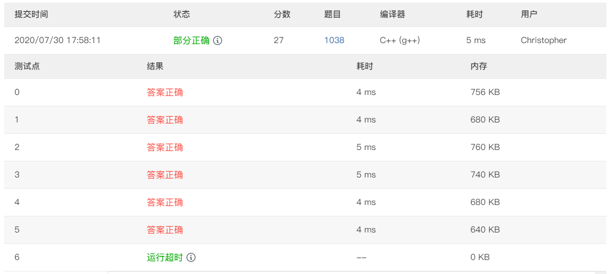

### 题意
给出若干个数字段，问将它们组合起来得到最小数是多少

### 思路
数据规模达到$10^4$，暴力肯定是不行的。比较容易想到的一点是按照首位数字排序，数字小的肯定往前排，然后就是首数字相同的数字段之间进行排列，我一开始想到的是如下的算法：

```cpp
let flag = false
while true :
    for i in range(segments).length() :
        if recover(segement[i - 1], segment[i]) > recover(segement[i], segment[i - 1]) :
            swap(segement[i - 1], segment[i])
            flag = true
    if flag == false :
        break
```

这种算法是可以得到27分的，因为最坏情况下该算法的复杂度可能达到$O(n^2)$



观察上述算法的过程，其实就类似于一个冒泡排序的过程，那么我们可以将`recover(segement[i - 1], segment[i]) < recover(segement[i], segment[i - 1]) `作为排序的条件，对整个序列进行一次sort，那么最终得到的结果一定是满足最小的，可以使用反证法证明：

设有一个序列为$\{a, b, c, d, e\}$，对齐按照上述的规则排序后的结果为：$\{b, a, d, e, c\}$，也就是说有$recover(b, a) < recover(a, b)$此时若有序列$\{a, b, e, d, c\}$更优，那么有$recover(a, b, e, d, c) < recover(b, a, e, d, c)$，则有$recover(a, b) < recover(b, a)$，产生矛盾，因此排序后的序列必定为最优

具体实现时，用结构体存储字符串，另外只要写一个cmp函数或是重载一个运算符就好了
